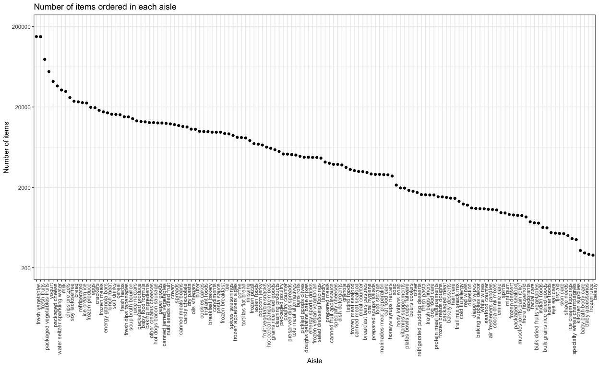

p8105\_hw3\_xy2395
================
Jack Yan
10/04/2018

Problem 1
=========

The following code trunk

-   formats the data to use appropriate variable names using `clean_names()`,
-   focuses on the “Overall Health” topic using `filter()`,
-   includes only responses from “Excellent” to “Poor” (i.e. no pre-collapsed categories), and
-   organizes responses as a factor taking levels ordered from “Excellent” to “Poor”, using `fct_relevel`.

``` r
tidy_brfss = 
  brfss_smart2010 %>% 
  janitor::clean_names() %>% 
  filter(topic == "Overall Health") %>% 
  select(-(class:question), -sample_size, -(confidence_limit_low : geo_location)) %>% 
  mutate(response = fct_relevel(response, c("Excellent", "Very good", "Good", "Fair", "Poor")))

tidy_brfss
```

    ## # A tibble: 10,625 x 5
    ##     year locationabbr locationdesc          response  data_value
    ##    <int> <chr>        <chr>                 <fct>          <dbl>
    ##  1  2010 AL           AL - Jefferson County Excellent       18.9
    ##  2  2010 AL           AL - Jefferson County Very good       30  
    ##  3  2010 AL           AL - Jefferson County Good            33.1
    ##  4  2010 AL           AL - Jefferson County Fair            12.5
    ##  5  2010 AL           AL - Jefferson County Poor             5.5
    ##  6  2010 AL           AL - Mobile County    Excellent       15.6
    ##  7  2010 AL           AL - Mobile County    Very good       31.3
    ##  8  2010 AL           AL - Mobile County    Good            31.2
    ##  9  2010 AL           AL - Mobile County    Fair            15.5
    ## 10  2010 AL           AL - Mobile County    Poor             6.4
    ## # ... with 10,615 more rows

``` r
summary(tidy_brfss)
```

    ##       year      locationabbr       locationdesc            response   
    ##  Min.   :2002   Length:10625       Length:10625       Excellent:2125  
    ##  1st Qu.:2005   Class :character   Class :character   Very good:2125  
    ##  Median :2007   Mode  :character   Mode  :character   Good     :2125  
    ##  Mean   :2007                                         Fair     :2125  
    ##  3rd Qu.:2009                                         Poor     :2125  
    ##  Max.   :2010                                                         
    ##                                                                       
    ##    data_value   
    ##  Min.   : 0.40  
    ##  1st Qu.: 8.40  
    ##  Median :21.70  
    ##  Mean   :19.97  
    ##  3rd Qu.:30.30  
    ##  Max.   :51.10  
    ##  NA's   :28

Questions
---------

### Question 1.1

In 2002, which states were observed at 7 locations?

``` r
states_observed_7_locs = 
  tidy_brfss %>% 
  filter(year == 2002) %>% 
  group_by(locationabbr) %>% 
  summarize(n_locations = n_distinct(locationdesc)) %>% 
  filter(n_locations == 7)

states_observed_7_locs
```

    ## # A tibble: 3 x 2
    ##   locationabbr n_locations
    ##   <chr>              <int>
    ## 1 CT                     7
    ## 2 FL                     7
    ## 3 NC                     7

As shown above, CT, FL and NC were observed at 7 locations in 2002.

### Question 1.2

Make a “spaghetti plot” that shows the number of **locations** in each state from 2002 to 2010.

``` r
n_locations_in_state =
  tidy_brfss %>% 
  group_by(year, locationabbr, locationdesc) %>% 
  distinct(locationdesc) %>%  
  group_by(year, locationabbr) %>% 
  count()

n_locations_in_state %>% 
  ggplot(aes(x = year, y = n, color = locationabbr)) +
    geom_line() +
    labs(
      title = "Number of locations in each state",
      x = "Year",
      y = "Number of locations",
      color = 'States'
    ) 
```


``` r
n_locations_in_state %>% 
arrange(desc(n))
```

    ## # A tibble: 443 x 3
    ## # Groups:   year, locationabbr [443]
    ##     year locationabbr     n
    ##    <int> <chr>        <int>
    ##  1  2007 FL              44
    ##  2  2010 FL              41
    ##  3  2005 NJ              19
    ##  4  2006 NJ              19
    ##  5  2009 NJ              19
    ##  6  2010 NJ              19
    ##  7  2008 NJ              18
    ##  8  2007 NJ              16
    ##  9  2008 NC              16
    ## 10  2010 TX              16
    ## # ... with 433 more rows

This plot shows the number of locations observed in each state varying from 2002 to 2010. For the majority of states, number of locations varied between 1 and 8 and stayed almost stable. For some other states such as FL, NJ and TX, number of locations witnessed rapid change. Most noticeably, the number of locations in FL changed rapidly in 2007, 2008 and 2010. States are discerned both by color and by numbers given above, since the number of states are too large to render a discernable color range.

### Question 1.3

Make a table showing, for the years 2002, 2006, and 2010, the mean and standard deviation of the proportion of “Excellent” responses across locations in NY State.

``` r
tidy_brfss %>% 
  filter(year == 2002 | year == 2006 | year == 2010) %>% 
  filter(locationabbr == "NY") %>% 
  filter(response == "Excellent") %>% 
  group_by(year) %>% 
  summarize(
    mean = mean(data_value),
    sd = sd(data_value)
  ) %>% 
  gather(key = type_of_statistics, value = value, mean:sd) %>% 
  spread(key = year, value = value) %>% 
  knitr::kable(digits = 2, 
               format = 'html', 
               caption = "Table: Mean and standard deviation of the proportion of “Excellent” responses across locations in NY State",
               col.names = c("Type of Statistics", "2002", "2006", "2010")
  )
```

<table>
<caption>
Table: Mean and standard deviation of the proportion of “Excellent” responses across locations in NY State
</caption>
<thead>
<tr>
<th style="text-align:left;">
Type of Statistics
</th>
<th style="text-align:right;">
2002
</th>
<th style="text-align:right;">
2006
</th>
<th style="text-align:right;">
2010
</th>
</tr>
</thead>
<tbody>
<tr>
<td style="text-align:left;">
mean
</td>
<td style="text-align:right;">
24.04
</td>
<td style="text-align:right;">
22.53
</td>
<td style="text-align:right;">
22.70
</td>
</tr>
<tr>
<td style="text-align:left;">
sd
</td>
<td style="text-align:right;">
4.49
</td>
<td style="text-align:right;">
4.00
</td>
<td style="text-align:right;">
3.57
</td>
</tr>
</tbody>
</table>
This table above shows the mean and standard deviation of the proportion of "Excellent" responses across locations in NY state. Among the three years, the mean is the highest in 2002 and the lowest in 2006. The standard deviation is the highest in 2002 and the lowest in 2010. Mean and standard deviation were relatively stable in the three years.

### Question 1.4

For each year and state, compute the average proportion in each response category (taking the average across locations in a state). Make a five-panel plot that shows, for each response category separately, the distribution of these state-level averages over time.

``` r
tidy_brfss %>% 
  group_by(year, locationabbr, response) %>% 
  summarize(mean = mean(data_value, na.rm = TRUE)) %>% 
  ggplot(aes(x = year, y = mean, color = response)) +
    geom_point() +
    facet_grid( ~ response) +
    theme(legend.position = "bottom", 
          panel.spacing = unit(1, "lines"),
          axis.text.x = element_text(size = rel(0.8))
    ) +
    labs(
      title = "Distribution of state-level average proportion of response",
      x = "Year",
      y = "Average Proportion (%)",
      color = 'Response'
    ) 
```


As shown in the graph, the average proportion of each response among states over the years are generally similar, with a range of ~10%, and with some outliers. For each of the five responses, their proportion stayed stable across the years. This plot also helps us compare the proportion of each response.For instance, the response 'Very Good' had an overall highest proportion and the response 'Poor' had the lowest.

Problem 2
=========

Description
-----------

The instacart data, held in a `tibble`, contains 1384617 observations and 15 variables.

In this dataset, key variables involved in the following questions include `aisle` and `aisle_id`, which denote the names and identifiers of distinct aisles, `product_name` and `product_id`, which denote names and identifiers of distinct products (items), and `order_dow` and `order_hour_of_day`, which denote the day of the week, and the hour of the day that the order was placed, respectively. Other variables not involved in this problem may also be of interest for other purposes.

Each observation (row) in this dataset denotes a product bought in an order. Different products bought in the same order are separated in different rows. For example, as printed below, the first 5 rows in this dataset contain 15 variables. They are different products bought in order \#1 by the same customer. The first product was Bulgarian Yogurt from the yogurt aisle, dairy eggs department. It was bought on 10 a.m. Wednesday.

``` r
options(tibble.width = Inf) 
instacart[1:5, ]
```

    ## # A tibble: 5 x 15
    ##   order_id product_id add_to_cart_order reordered user_id eval_set
    ##      <int>      <int>             <int>     <int>   <int> <chr>   
    ## 1        1      49302                 1         1  112108 train   
    ## 2        1      11109                 2         1  112108 train   
    ## 3        1      10246                 3         0  112108 train   
    ## 4        1      49683                 4         0  112108 train   
    ## 5        1      43633                 5         1  112108 train   
    ##   order_number order_dow order_hour_of_day days_since_prior_order
    ##          <int>     <int>             <int>                  <int>
    ## 1            4         4                10                      9
    ## 2            4         4                10                      9
    ## 3            4         4                10                      9
    ## 4            4         4                10                      9
    ## 5            4         4                10                      9
    ##   product_name                                  aisle_id department_id
    ##   <chr>                                            <int>         <int>
    ## 1 Bulgarian Yogurt                                   120            16
    ## 2 Organic 4% Milk Fat Whole Milk Cottage Cheese      108            16
    ## 3 Organic Celery Hearts                               83             4
    ## 4 Cucumber Kirby                                      83             4
    ## 5 Lightly Smoked Sardines in Olive Oil                95            15
    ##   aisle                department  
    ##   <chr>                <chr>       
    ## 1 yogurt               dairy eggs  
    ## 2 other creams cheeses dairy eggs  
    ## 3 fresh vegetables     produce     
    ## 4 fresh vegetables     produce     
    ## 5 canned meat seafood  canned goods

Questions
---------

### Question 2.1

How many aisles are there, and which aisles are the most items ordered from?

``` r
instacart %>% 
  distinct(aisle) %>% 
  nrow()
```

    ## [1] 134

``` r
instacart %>% 
  count(aisle) %>% 
  arrange(desc(n))
```

    ## # A tibble: 134 x 2
    ##    aisle                              n
    ##    <chr>                          <int>
    ##  1 fresh vegetables              150609
    ##  2 fresh fruits                  150473
    ##  3 packaged vegetables fruits     78493
    ##  4 yogurt                         55240
    ##  5 packaged cheese                41699
    ##  6 water seltzer sparkling water  36617
    ##  7 milk                           32644
    ##  8 chips pretzels                 31269
    ##  9 soy lactosefree                26240
    ## 10 bread                          23635
    ## # ... with 124 more rows

There are 134 aisles in this dataset. Since each observation denotes an item being bought, counting the number of observations by aisle tells us the number of items ordered from each aisle. Sorting the numbers, we find that the most items are ordered from the `fresh vegetables` aisle, followed by the `fresh fruits` aisle and `packaged vegetables fruits` aisle.

### Question 2.2

Make a plot that shows the number of items ordered in each aisle. Order aisles `sensibly`, and organize your plot so others can read it.

``` r
instacart %>% 
  count(aisle) %>% 
  mutate(aisle = fct_reorder(aisle, desc(n))) %>% 
  ggplot(aes(x = aisle, y = n)) +
  scale_y_log10(breaks = c(200000,20000, 2000, 200),labels=c("200000","20000", "2000", "200"), limits = c(200,200001)) +
    geom_point() +
    theme(axis.text.x = element_text(angle = 90, hjust = 1, size = rel(1))) +
    labs(
      title = "Number of items ordered in each aisle",
      x = "Aisle",
      y = "Number of items"
    ) 
```



This plot orderly shows number of items ordered in each aisle, using a *l**o**g*<sub>10</sub> y-scale in order to better show differences among small numbers. It shows that fresh vegetables and fresh fruits are the two most popular aisles. From this plot, we can see that the numbers of items ordered in each aisle vary a lot, ranging approximately between 200 and 200,000.

### Question 2.3

Make a table showing the most popular item aisles “baking ingredients”, “dog food care”, and “packaged vegetables fruits”.

``` r
instacart %>% 
  filter(aisle %in% c('baking ingredients', 'dog food care', 'packaged vegetables fruits')) %>% 
  group_by(aisle, product_name)  %>% 
  count() %>% 
  group_by(aisle) %>% 
  filter(n == max(n)) %>% # This step is tricky
  select(aisle, product_name) %>% 
  knitr::kable(
    col.names = c("Aisle", "Most popular item"), 
    format = 'html', 
    caption = "Table: The most popular item in three aisles"
  )
```

<table>
<caption>
Table: The most popular item in three aisles
</caption>
<thead>
<tr>
<th style="text-align:left;">
Aisle
</th>
<th style="text-align:left;">
Most popular item
</th>
</tr>
</thead>
<tbody>
<tr>
<td style="text-align:left;">
baking ingredients
</td>
<td style="text-align:left;">
Light Brown Sugar
</td>
</tr>
<tr>
<td style="text-align:left;">
dog food care
</td>
<td style="text-align:left;">
Snack Sticks Chicken & Rice Recipe Dog Treats
</td>
</tr>
<tr>
<td style="text-align:left;">
packaged vegetables fruits
</td>
<td style="text-align:left;">
Organic Baby Spinach
</td>
</tr>
</tbody>
</table>
The most popular item in aisles “baking ingredients”, “dog food care”, and “packaged vegetables fruits” are Light Brown Sugar, Snack Sticks Chicken & Rice Recipe Dog Treats, and Organic Baby Spinach, respectively.

### Question 2.4

Make a table showing the mean hour of the day at which Pink Lady Apples and Coffee Ice Cream are ordered on each day of the week; format this table for human readers (i.e. produce a 2 x 7 table).

``` r
instacart %>% 
  mutate(order_dow = factor(order_dow, labels = c("Sun", "Mon", "Tue", "Wed", "Thu", "Fri", "Sat"))) %>% 
  filter(product_name %in% c('Pink Lady Apples', "Coffee Ice Cream")) %>% 
  group_by(product_name, order_dow) %>% 
  summarize(mean = mean(order_hour_of_day)) %>% 
  spread(key = order_dow, value = mean) %>% 
  knitr::kable(digit = 2, 
               format = 'html', 
               col.names = c("Product Name", "Sun", "Mon", "Tue", "Wed", "Thu", "Fri", "Sat"),
               caption = "Table: Mean hour of the day at which Pink Lady Apples and Coffee Ice Cream are ordered"
  )
```

<table>
<caption>
Table: Mean hour of the day at which Pink Lady Apples and Coffee Ice Cream are ordered
</caption>
<thead>
<tr>
<th style="text-align:left;">
Product Name
</th>
<th style="text-align:right;">
Sun
</th>
<th style="text-align:right;">
Mon
</th>
<th style="text-align:right;">
Tue
</th>
<th style="text-align:right;">
Wed
</th>
<th style="text-align:right;">
Thu
</th>
<th style="text-align:right;">
Fri
</th>
<th style="text-align:right;">
Sat
</th>
</tr>
</thead>
<tbody>
<tr>
<td style="text-align:left;">
Coffee Ice Cream
</td>
<td style="text-align:right;">
13.77
</td>
<td style="text-align:right;">
14.32
</td>
<td style="text-align:right;">
15.38
</td>
<td style="text-align:right;">
15.32
</td>
<td style="text-align:right;">
15.22
</td>
<td style="text-align:right;">
12.26
</td>
<td style="text-align:right;">
13.83
</td>
</tr>
<tr>
<td style="text-align:left;">
Pink Lady Apples
</td>
<td style="text-align:right;">
13.44
</td>
<td style="text-align:right;">
11.36
</td>
<td style="text-align:right;">
11.70
</td>
<td style="text-align:right;">
14.25
</td>
<td style="text-align:right;">
11.55
</td>
<td style="text-align:right;">
12.78
</td>
<td style="text-align:right;">
11.94
</td>
</tr>
</tbody>
</table>
Mean hour of the day at which Pink Lady Apples and Coffee Ice Cream are ordered follow different patterns. Coffee Ice Cream is on average ordered in the afternoons (around 1430) with the only exception of Friday. For 4 days in a week, Pink Lady Apples are ordered on average before noon (around 1145). In general, the time in a day Pink Lady Apples are ordered is before the time in a day Coffee Ice Cream is ordered.

``` r
instacart %>% 
  mutate(order_dow = factor(order_dow, labels = c("Sun", "Mon", "Tue", "Wed", "Thu", "Fri", "Sat"))) %>% 
  filter(product_name %in% c('Pink Lady Apples', "Coffee Ice Cream")) %>% 
  group_by(product_name, order_dow) %>% 
  summarize(mean = mean(order_hour_of_day)) %>% 
  ggplot(aes(x = order_dow, y = mean, color = product_name)) +
    geom_point() 
```


In this case, a plot may be more informative than table.

Problem 3
=========

Description
-----------

The data contains 2595176 observations and 7 variables. The dataset is stored in a `tibble`. 5 variables in the original dataset stores weather data: `prcp` means precipitation in tenths of mm, `snow` denotes snowfall in mm, `snwd` means snow depth in mm, and `tmax` and `tmin` denotes maximum and minimum temperature in tenths of degrees C, respectively. Additionally, `id` denotes ID of the station conducting this observation, and `date` indicates the date when observation was made. According to Jeff, 'each weather station may collect only a subset of these variables, so the resulting dataset contains extensive missing data.' However, given the large number of weather stations, the data collectively can as well reflect the weather condition in New York. Therefore, missing data would not be a fatal problem for our analysis.

Questions
---------

### Question 3.1

Do some data cleaning. Create separate variables for year, month, and day. Ensure observations for temperature, precipitation, and snowfall are given in reasonable units. For snowfall, what are the most commonly observed values? Why?

``` r
# do some data cleaning
tidy_ny_noaa = ny_noaa %>% 
  mutate(
    year = as.integer(year(date)),
    month = as.integer(month(date)),
    day = as.integer(day(date)),
    tmax = as.numeric(tmax) / 10,
    tmin = as.numeric(tmin) / 10,
    prcp = prcp / 10
  ) %>% 
  select(id, date, year, month, day, everything())

head(tidy_ny_noaa)
```

    ## # A tibble: 6 x 10
    ##   id          date        year month   day  prcp  snow  snwd  tmax  tmin
    ##   <chr>       <date>     <int> <int> <int> <dbl> <int> <int> <dbl> <dbl>
    ## 1 US1NYAB0001 2007-11-01  2007    11     1    NA    NA    NA    NA    NA
    ## 2 US1NYAB0001 2007-11-02  2007    11     2    NA    NA    NA    NA    NA
    ## 3 US1NYAB0001 2007-11-03  2007    11     3    NA    NA    NA    NA    NA
    ## 4 US1NYAB0001 2007-11-04  2007    11     4    NA    NA    NA    NA    NA
    ## 5 US1NYAB0001 2007-11-05  2007    11     5    NA    NA    NA    NA    NA
    ## 6 US1NYAB0001 2007-11-06  2007    11     6    NA    NA    NA    NA    NA

``` r
tidy_ny_noaa %>% 
  count(snow) %>% 
  arrange(desc(n)) %>% 
  head()
```

    ## # A tibble: 6 x 2
    ##    snow       n
    ##   <int>   <int>
    ## 1     0 2008508
    ## 2    NA  381221
    ## 3    25   31022
    ## 4    13   23095
    ## 5    51   18274
    ## 6    76   10173

For snowfall, `0`s are the most commonly observed values because for most of the days it did not snow in New York.

### Question 3.2

Make a two-panel plot showing the average **max** temperature in January and in July in each station across years. Is there any observable / interpretable structure? Any outliers?

``` r
tidy_ny_noaa %>% 
  filter(is.na(tmax) == FALSE) %>% 
  filter(month == 7 | month == 1) %>% 
  group_by(year, month,id) %>%
  summarize(avg_tmax = mean(tmax, na.rm = TRUE)) %>% 
  ggplot(aes(x = year, y = avg_tmax, group = year)) +
    geom_boxplot() +
    facet_grid(~month, labeller = as_labeller(c("1" = "Jan", "7" = "Jul"))) +
    labs(
      title = "Average max temperature in January and in July in each station across years",
      x = "Year",
      y = "Average Maximum Temperature (C)"
    )
```


The average maximum temperature is higher in July than in January for each year across all the weather stations. The temperature is around 0 C in January and around 27 C in July. Most outliers in January are higher temperatures and most outliers in July are lower temperatures. This indicates that in Janurary, some parts of the city had remarkably higher temperature than the city's general temperature, and in July, some parts of the city had remarkably lower temperature than the city's temperature in general.

### Question 3.3

Make a two-panel plot showing (i) tmax vs tmin for the full dataset (note that a scatterplot may NOT be the best option), and (ii) make a plot showing the distribution of snowfall values greater than 0 and less than 100 separately by year.

``` r
# plot the 1st panel
plot_temp = 
  tidy_ny_noaa %>% 
  filter(is.na(tmax) == FALSE,  is.na(tmin) == FALSE) %>% 
  ggplot(aes(x = tmin, y = tmax)) +
  geom_hex(show.legend = T) +
  labs(
      title = "Maximum vs Minimum Temperature",
      x = "Minimum Temperature (C)",
      y = "Maximum Temperature (C)"
  ) +
  theme(legend.position = "right")
```

``` r
# plot the 2nd panel
plot_snow = 
tidy_ny_noaa %>% 
  filter(snow > 0, snow < 100) %>% 
  ggplot(aes(x = year, y = snow)) +
  geom_boxplot(aes(group=year)) +
  labs(
      title = "Distribution of snowfall",
      x = "Year",
      y = "Snowfall (mm)"
  ) 

# combine the two plots using patchwork
plot_temp + plot_snow
```


A scatterplot can only represent point density up to a certain threshold. Since the number of points is extremely large and we want to see the overall distribution of `tmax` against `tmin`, it is better that we use hexagonal heatmap. Looking at the plot, we can see a light linear region inside the outer darker region. Because lighter color indicates more counts, this pattern suggests that most of the max temperature and min temperature are correlated.

In this case, using boxplot can help us see the outliers more clearly. As shown in the second plot, for most years (e.g. 1980 - 1997), the distribution of snowfall remained stable. However, 2006 witnessed a noticeably lower amount of snowfall, and the outliers in this year are the most.
