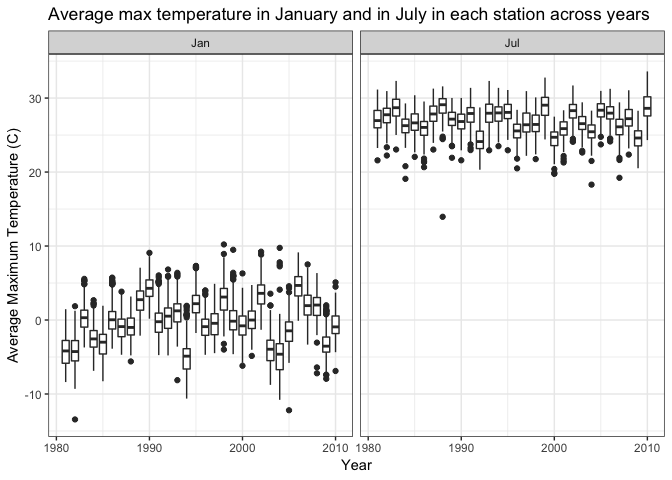

p8105\_hw3\_xy2395
================
Jack Yan
10/04/2018

knitr::opts\_chunk$set( fig.width = 6, fig.asp = .6, out.width = "90%" )

This homework includes figures; the readability of your embedded plots (e.g. font sizes, axis labels, titles) will be assessed in Problems 1+.

Problem 1
=========

Data Cleaning
-------------

The following code trunk

-   formats the data to use appropriate variable names using `clean_names()`,
-   focuses on the “Overall Health” topic using `filter()`,
-   include only responses from “Excellent” to “Poor” (i.e. no pre-collapsed categories), and
-   organizes responses as a factor taking levels from “Excellent” to “Poor”.

``` r
tidy_brfss = 
  brfss_smart2010 %>% 
  janitor::clean_names() %>% 
  filter(topic == "Overall Health") %>% 
  select(-(class:question), -sample_size, -(confidence_limit_low : geo_location)) %>% 
  mutate(
    response = fct_relevel(response, c("Excellent", "Very good", "Good", "Fair", "Poor"))
    )
summary(tidy_brfss)
```

    ##       year      locationabbr       locationdesc            response   
    ##  Min.   :2002   Length:10625       Length:10625       Excellent:2125  
    ##  1st Qu.:2005   Class :character   Class :character   Very good:2125  
    ##  Median :2007   Mode  :character   Mode  :character   Good     :2125  
    ##  Mean   :2007                                         Fair     :2125  
    ##  3rd Qu.:2009                                         Poor     :2125  
    ##  Max.   :2010                                                         
    ##                                                                       
    ##    data_value   
    ##  Min.   : 0.40  
    ##  1st Qu.: 8.40  
    ##  Median :21.70  
    ##  Mean   :19.97  
    ##  3rd Qu.:30.30  
    ##  Max.   :51.10  
    ##  NA's   :28

Questions
---------

### Question 1

In 2002, which states were observed at 7 locations?

``` r
tidy_brfss %>% 
  filter(year == 2002) %>% 
  group_by(locationabbr) %>% 
  summarize(n_locations = n_distinct(locationdesc)) %>% 
  filter(n_locations == 7)
```

    ## # A tibble: 3 x 2
    ##   locationabbr n_locations
    ##   <chr>              <int>
    ## 1 CT                     7
    ## 2 FL                     7
    ## 3 NC                     7

CT, FL and NC were observed at 7 locations in 2002.

### Question 2

Make a “spaghetti plot” that shows the number of observations in each state from 2002 to 2010.

``` r
tidy_brfss %>% 
  group_by(locationabbr, year) %>% 
  count() %>% 
  ggplot(aes(x = year, y = n, color = locationabbr)) +
    geom_line() +
    labs(
      title = "Number of observations in each state",
      x = "Year",
      y = "Number of observations"
    ) 
```


### Question 3

Make a table showing, for the years 2002, 2006, and 2010, the mean and standard deviation of the proportion of “Excellent” responses across locations in NY State.

``` r
tidy_brfss %>% 
  filter(year == 2002 | year == 2006 | year == 2010) %>% 
  filter(locationabbr == "NY") %>% 
  filter(response == "Excellent") %>% 
  group_by(year) %>% 
  summarize(
    mean = mean(data_value),
    sd = sd(data_value)
  ) %>% 
  gather(key = type_of_statistics, value = value, mean:sd) %>% 
  spread(key = year, value = value) %>% 
  knitr::kable(digits = 2, caption = "Mean and standard deviation of the proportion of “Excellent” responses across locations in NY State")
```

| type\_of\_statistics |   2002|   2006|   2010|
|:---------------------|------:|------:|------:|
| mean                 |  24.04|  22.53|  22.70|
| sd                   |   4.49|   4.00|   3.57|

### Question 4

For each year and state, compute the average proportion in each response category (taking the average across locations in a state). Make a five-panel plot that shows, for each response category separately, the distribution of these state-level averages over time.

``` r
tidy_brfss %>% 
  group_by(year, locationabbr, response) %>% 
  summarize(mean = mean(data_value, na.rm = TRUE)) %>% 
  ggplot(aes(x = year, y = mean, color = response)) +
    geom_point() +
    facet_grid( ~ response) +
    theme(legend.position = "bottom", panel.spacing = unit(1, "lines")) 
```


Problem 2
=========

The goal is to do some exploration of this dataset. To that end, write a `short description` of the dataset, noting the `size` and `structure` of the data, `describing` some `key variables`, and giving `illstrative examples of observations`. Then, do or answer the following (`commenting on the results of each`):

Description
-----------

The data contains 1384617 observations and 15 variables.

Questions
---------

### Question 1

How many aisles are there, and which aisles are the most items ordered from?

``` r
instacart %>% 
  distinct(aisle) %>% 
  nrow()
```

    ## [1] 134

``` r
instacart %>% 
  count(aisle) %>% 
  arrange(desc(n))
```

    ## # A tibble: 134 x 2
    ##    aisle                              n
    ##    <chr>                          <int>
    ##  1 fresh vegetables              150609
    ##  2 fresh fruits                  150473
    ##  3 packaged vegetables fruits     78493
    ##  4 yogurt                         55240
    ##  5 packaged cheese                41699
    ##  6 water seltzer sparkling water  36617
    ##  7 milk                           32644
    ##  8 chips pretzels                 31269
    ##  9 soy lactosefree                26240
    ## 10 bread                          23635
    ## # ... with 124 more rows

There are 134 aisles in this dataset, and most items are ordered from the fresh vegetables aisle, followed by the fresh fruits aisle.

### Question 2

Make a plot that shows the number of items ordered in each aisle. Order aisles `sensibly`, and organize your plot so others can read it.

``` r
instacart %>% 
  count(aisle) %>% 
  mutate(
    aisle = fct_reorder(aisle, desc(n))
    ) %>% 
  ggplot(aes(x = aisle, y = n)) +
    geom_point() +
    theme(axis.text.x = element_text(angle = 90, hjust = 1))
```


### Question 3

Make a table showing the most popular item aisles “baking ingredients”, “dog food care”, and “packaged vegetables fruits”.

``` r
instacart %>% 
  filter(aisle %in% c('baking ingredients', 'dog food care', 'packaged vegetables fruits')) %>% 
  group_by(aisle, product_name)  %>% 
  count() %>% 
  group_by(aisle) %>% 
  filter(n == max(n)) %>% # This step is tricky
  select(aisle, product_name) %>% 
  knitr::kable(col.names = c("Aisle", "Most popular item"))
```

| Aisle                      | Most popular item                             |
|:---------------------------|:----------------------------------------------|
| baking ingredients         | Light Brown Sugar                             |
| dog food care              | Snack Sticks Chicken & Rice Recipe Dog Treats |
| packaged vegetables fruits | Organic Baby Spinach                          |

### Question 4

Make a table showing the mean hour of the day at which Pink Lady Apples and Coffee Ice Cream are ordered on each day of the week; format this table for human readers (i.e. produce a 2 x 7 table).

``` r
instacart %>% 
  mutate(order_dow = factor(order_dow, labels = c("Sun", "Mon", "Tue", "Wed", "Thu", "Fri", "Sat"))) %>% 
  filter(product_name %in% c('Pink Lady Apples', "Coffee Ice Cream")) %>% 
  group_by(product_name, order_dow) %>% 
  summarize(mean = mean(order_hour_of_day)) %>% 
  spread(key = order_dow, value = mean) %>% 
  knitr::kable(digit = 2)
```

| product\_name    |    Sun|    Mon|    Tue|    Wed|    Thu|    Fri|    Sat|
|:-----------------|------:|------:|------:|------:|------:|------:|------:|
| Coffee Ice Cream |  13.77|  14.32|  15.38|  15.32|  15.22|  12.26|  13.83|
| Pink Lady Apples |  13.44|  11.36|  11.70|  14.25|  11.55|  12.78|  11.94|

Problem 3
=========

The goal is to do some exploration of this dataset. To that end, write a short description of the dataset, noting the size and structure of the data, describing some key variables, and indicating the extent to which `missing data` is an issue. Then, do or answer the following (commenting on the results of each):

Description
-----------

The data contains 2595176 observations and 7 variables.

Questions
---------

### Question 1

Do some data cleaning. Create separate variables for year, month, and day. Ensure observations for temperature, precipitation, and snowfall are given in reasonable units. For snowfall, what are the most commonly observed values? Why?

``` r
tidy_ny_noaa = ny_noaa %>% 
  mutate(
    year = as.integer(year(date)),
    month = as.integer(month(date)),
    day = as.integer(day(date)),
    tmax = as.numeric(tmax) / 10,
    tmin = as.numeric(tmin) / 10,
    prcp = prcp / 10
  ) %>% 
  select(id, date, year, month, day, everything())

head(tidy_ny_noaa)
```

    ## # A tibble: 6 x 10
    ##   id          date        year month   day  prcp  snow  snwd  tmax  tmin
    ##   <chr>       <date>     <int> <int> <int> <dbl> <int> <int> <dbl> <dbl>
    ## 1 US1NYAB0001 2007-11-01  2007    11     1    NA    NA    NA    NA    NA
    ## 2 US1NYAB0001 2007-11-02  2007    11     2    NA    NA    NA    NA    NA
    ## 3 US1NYAB0001 2007-11-03  2007    11     3    NA    NA    NA    NA    NA
    ## 4 US1NYAB0001 2007-11-04  2007    11     4    NA    NA    NA    NA    NA
    ## 5 US1NYAB0001 2007-11-05  2007    11     5    NA    NA    NA    NA    NA
    ## 6 US1NYAB0001 2007-11-06  2007    11     6    NA    NA    NA    NA    NA

``` r
tidy_ny_noaa %>% 
  count(snow) %>% 
  arrange(desc(n)) %>% 
  head()
```

    ## # A tibble: 6 x 2
    ##    snow       n
    ##   <int>   <int>
    ## 1     0 2008508
    ## 2    NA  381221
    ## 3    25   31022
    ## 4    13   23095
    ## 5    51   18274
    ## 6    76   10173

For snowfall, `0`s are the most commonly observed values because for most of the days it did not snow in New York.

### Question 2

Make a two-panel plot showing the average temperature in January and in July in each station across years. Is there any observable / interpretable structure? Any outliers?

``` r
tidy_ny_noaa %>% 
  filter(month == 7 | month == 1) %>% 
  group_by(id, year, month) %>%
  summarize(avg_tmax = mean(tmax, na.rm = TRUE),
            avg_tmin = mean(tmin, na.rm = TRUE)
            ) %>% 
  ggplot(aes(x = year, y = avg_tmax, group = year)) +
    geom_boxplot() +
    facet_grid(~month)
```

    ## Warning: Removed 5970 rows containing non-finite values (stat_boxplot).


### Question 3

Make a two-panel plot showing (i) tmax vs tmin for the full dataset (note that a scatterplot may NOT be the best option); and (ii) make a plot showing the distribution of snowfall values greater than 0 and less than 100 separately by year.

``` r
tidy_ny_noaa %>% 
  filter(is.na(tmax) == FALSE,  is.na(tmin) == FALSE) %>% 
  ggplot(aes(x = tmax, y = tmin)) +
  geom_hex()
```


``` r
tidy_ny_noaa %>% 
  filter(snow > 0, snow < 100) %>% 
  ggplot(aes(x = year, y = snow)) +
  geom_violin(aes(group=year)) 
```



``` r
tidy_ny_noaa %>% 
  filter(snow > 0, snow < 100) %>% 
  ggplot(aes(x = year, y = snow)) +
  geom_boxplot(aes(group=year)) 
```


